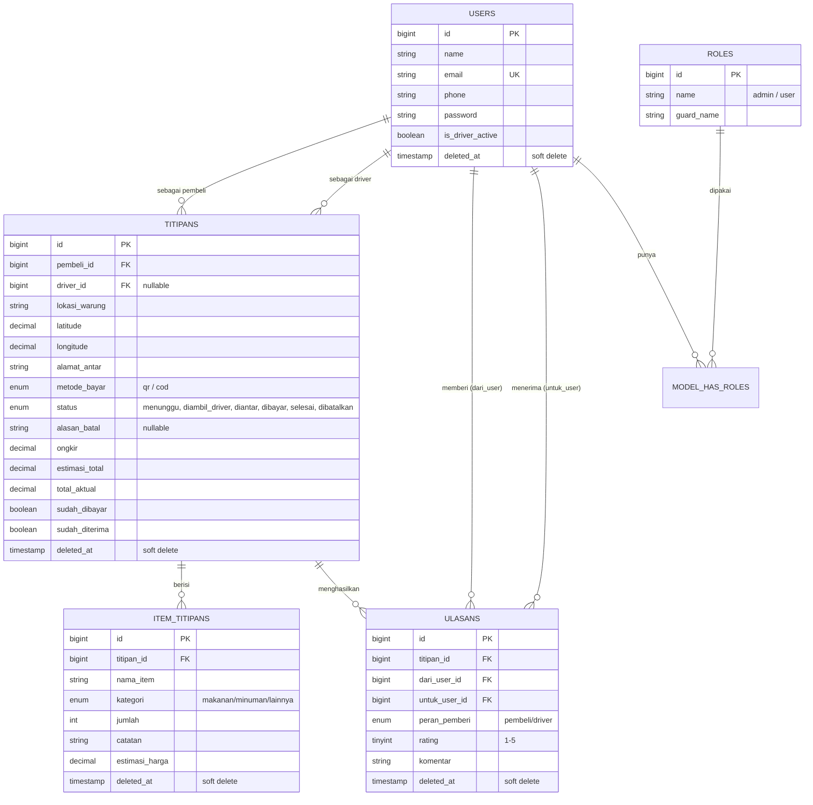

# Panduan Kolaborasi & Penyelesaian Proyek Nearty

Dokumen ini melengkapi `README.md`. Isinya: ERD final (dengan soft delete), pembagian tugas untuk 3 orang (Aulia, Hawa, Regina), git workflow kolaborasi, dan langkah-langkah supaya aplikasi selesai sesuai syarat dosen (lihat `Tugas_Besar_Pemograman_Web_Berbasis_Framework.pptx`).

---

## 1. Pemetaan Syarat Dosen → Yang Dikerjakan di Nearty

| Syarat Wajib | Implementasi di Nearty |
|---|---|
| Migration & Seeder | Semua tabel via migration, `DatabaseSeeder` menjalankan `RoleSeeder → UserSeeder → TitipanSeeder` (akun & data demo siap, tidak perlu database kosong) |
| Autentikasi | Laravel Breeze (login/register/logout), validasi input, proteksi CSRF |
| Role & Permission | Spatie Permission — role `admin` & `user` (lihat catatan di bagian 4 kenapa role Nearty berbeda dari role "pembeli/driver") |
| 3 Halaman CRUD | **Titipan**, **Item Titipan** (nested di form Titipan), **Ulasan** (rating) — semua di luar model User/Role |
| Dashboard | Statistik ringkas + grafik tren 7 hari (Chart.js), berbeda tampilan untuk admin vs user biasa |
| Search & Pagination | Ada di halaman daftar Titipan dan Kelola User (admin) |
| UI/UX Responsif | Layout sidebar kustom (Tailwind + Alpine), bukan tampilan default Breeze |
| REST API | `/api/titipans` dan `/api/ulasans`, autentikasi token via Sanctum, didokumentasikan di README |
| Git Workflow | Lihat bagian 5 di bawah |

---

## 2. ERD Final (dengan Soft Delete)



**Catatan penting soal soft delete:**
- `users`, `titipans`, `item_titipans`, `ulasans` semuanya punya kolom `deleted_at`.
- Titipan yang **dibatalkan** tidak dihapus permanen — cukup diberi `status = dibatalkan` + `alasan_batal`, lalu di-soft-delete supaya tidak muncul di daftar aktif tapi tetap bisa diaudit lewat menu **Titipan Dibatalkan** (admin).
- Akun user yang **dinonaktifkan** admin juga soft delete (bukan hapus permanen), bisa dipulihkan lewat menu **Akun Nonaktif**.
- Kalau butuh cek data yang sudah soft delete langsung dari DB: `SELECT * FROM titipans WHERE deleted_at IS NOT NULL;`

---

## 3. Kenapa Role Cuma "admin" & "user" (bukan "pembeli"/"driver")

Dosen mewajibkan minimal 2 role dengan Spatie Permission. Tapi konsep asli Nearty sengaja **tidak punya role tetap** — satu akun bisa jadi pembeli di satu titipan dan jadi driver di titipan lain (ditentukan lewat kolom `pembeli_id`/`driver_id`, plus toggle `is_driver_active`).

Supaya dua-duanya terpenuhi:
- Role **`user`** = semua pengguna aplikasi biasa (bisa buat titipan & bisa toggle jadi driver kapan saja).
- Role **`admin`** = tim internal yang mengelola user (nonaktifkan akun bermasalah, ubah role) dan memoderasi titipan yang dibatalkan.

Middleware `role:admin` (dari `spatie/laravel-permission`, alias didaftarkan di `bootstrap/app.php`) membatasi rute `/admin/*`.

---

## 4. Pembagian Tugas 3 Orang

Karena repo sudah dibuat Aulia dan starter kit (Breeze) sudah jalan, kalian tinggal jalan paralel di branch masing-masing di atas kode yang sudah ada.

### Aulia — Project Owner: Setup, Dashboard, Role & Permission, Review PR
- Menjaga branch `main` tetap stabil, review & merge Pull Request tim
- Dashboard (`DashboardController`, `resources/views/dashboard.blade.php`) — statistik + grafik
- Setup Spatie Permission (`RoleSeeder`, middleware `role:admin`, panel `admin/users`)
- Menyusun README.md, video teaser, dan lesson learned di akhir
- Branch: `feature/dashboard-role-admin`

### Hawa — Modul Titipan (CRUD Pembeli)
- CRUD **Titipan** + **Item Titipan** bersarang: buat, lihat daftar (search + pagination), ubah, batalkan (soft delete + alasan)
- Form dinamis tambah/hapus baris barang (`resources/views/titipan/create.blade.php`, `edit.blade.php`)
- Validasi lewat `StoreTitipanRequest` / `UpdateTitipanRequest`
- Branch: `feature/crud-titipan`

### Regina — Mode Driver, Ulasan, REST API
- Mode Driver: toggle available, daftar titipan terdekat (hitung jarak Haversine), ambil order, update status pengantaran
- CRUD **Ulasan** (rating 1-5 bintang setelah titipan selesai)
- REST API (`/api/titipans`, `/api/ulasans`) + autentikasi token Sanctum
- Branch: `feature/driver-ulasan-api`

> Semua controller, model, migration, dan view untuk 3 area di atas **sudah dibuat lengkap** di project ini sebagai starting point. Tugas kalian bertiga sekarang: pelajari kodenya, sesuaikan dengan gaya masing-masing, tambahkan validasi/edge case, lalu **commit dengan nama kalian sendiri** di branch masing-masing (jangan satu commit besar di akhir — dosen mengecek riwayat commit per anggota).

---

## 5. Git Workflow Kolaborasi (Step by Step)

Alur ini melanjutkan draft yang sudah dibuat Aulia, dirapikan dengan perintah konkret.

### Langkah 1 — Aulia (sudah selesai)
```bash
# project awal + starter kit Breeze sudah dibuat & di-push ke branch main
git remote add origin https://github.com/<username>/nearty.git
git push -u origin main
```
Lalu tambahkan Hawa & Regina sebagai **Collaborator** di menu *Settings → Collaborators* repo GitHub.

### Langkah 2 — Hawa & Regina: Clone Repo
```bash
git clone https://github.com/<username>/nearty.git
cd nearty
composer install
npm install
cp .env.example .env
php artisan key:generate
# atur .env: DB_DATABASE, DB_USERNAME, DB_PASSWORD
php artisan migrate --seed
npm run dev
```

### Langkah 3 — Kerja Paralel di Branch Sendiri
Setiap orang **wajib** membuat branch baru dari `main` sebelum mulai kerja, dan **tidak pernah** push langsung ke `main`:

```bash
git checkout main
git pull origin main          # pastikan branch lokal up-to-date dulu
git checkout -b feature/crud-titipan     # contoh branch Hawa
# ...ngoding...
git add .
git commit -m "feat: tambah validasi form titipan"
git push -u origin feature/crud-titipan
```

Lakukan commit **sesering mungkin per task/fitur kecil** (bukan 1 commit raksasa di akhir), contoh pesan commit yang baik:
```
feat: tambah halaman index titipan dengan search & pagination
fix: perbaiki validasi jumlah barang minimal 1
style: rapikan tampilan card titipan di mobile
```

### Langkah 4 — Pull Request & Review
1. Buka GitHub → tab **Pull Requests** → **New Pull Request**
2. Base: `main` ← Compare: `feature/crud-titipan` (branch kamu)
3. Isi deskripsi singkat fitur apa yang ditambahkan
4. Aulia (atau siapa pun yang bertugas review) mengecek kode, kasih komentar kalau ada yang perlu diperbaiki
5. Setelah disetujui → klik **Merge Pull Request**

### Langkah 5 — Sinkronisasi Setelah Merge
Setelah PR kamu (atau punya temen) di-merge ke `main`, semua anggota wajib update branch lokal masing-masing sebelum lanjut kerja:
```bash
git checkout main
git pull origin main
git checkout feature/driver-ulasan-api
git merge main          # bawa update terbaru main ke branch kerja kamu
```

### Aturan Tambahan
- **Jangan** `git push --force` ke `main`.
- Kalau ada konflik saat merge, selesaikan manual di editor, lalu `git add .` dan `git commit` untuk menutup proses merge.
- File `.env`, `vendor/`, `node_modules/` **tidak** ikut di-commit (sudah diatur di `.gitignore`).
- Sebelum demo, pastikan `main` sudah berisi gabungan seluruh fitur dan sudah dites jalan dari `git clone` bersih (`composer install && npm install && php artisan migrate --seed`).

---

## 6. Langkah Menuju "Selesai" (Checklist Akhir)

1. **Migrate + seed dari kosong** di masing-masing laptop untuk pastikan tidak ada migration yang bentrok:
   ```bash
   php artisan migrate:fresh --seed
   ```
2. **Coba login** dengan 4 akun demo di README, pastikan role admin bisa buka `/admin/users`, role user tidak bisa.
3. **Uji alur penuh**: buat titipan (Aulia/pembeli) → aktifkan mode driver di akun lain → ambil order → update status sampai selesai → beri ulasan.
4. **Uji REST API** pakai Postman/Insomnia: login dapat token → coba GET/POST/PATCH/DELETE `/api/titipans`.
5. **Cek search & pagination** di halaman Titipan Saya dan Kelola User dengan data > 8-10 baris (seeder bisa ditambah kalau data demo masih sedikit).
6. **Screenshot** dashboard, buat titipan, mode driver, dan panel admin → tempel di README.
7. **Rekam video teaser 3-5 menit** yang menunjukkan semua fitur wajib berjalan, upload YouTube (unlisted)/Drive, taruh link di README.
8. **Tulis Lesson Learned** (1-2 halaman): kendala yang dihadapi (misalnya sinkronisasi Git, penentuan role, dsb), solusinya, dan pelajaran yang didapat.
9. **Catat bug yang diketahui** (kalau ada) di README dengan jujur — lebih baik jujur daripada ketahuan saat demo.
10. Pastikan riwayat commit di GitHub terlihat merata dari 3 nama (Aulia, Hawa, Regina), bukan didominasi satu orang saja.

Selamat mengerjakan — Nearty, dari kost, untuk kost! 🛵
MDEOF
